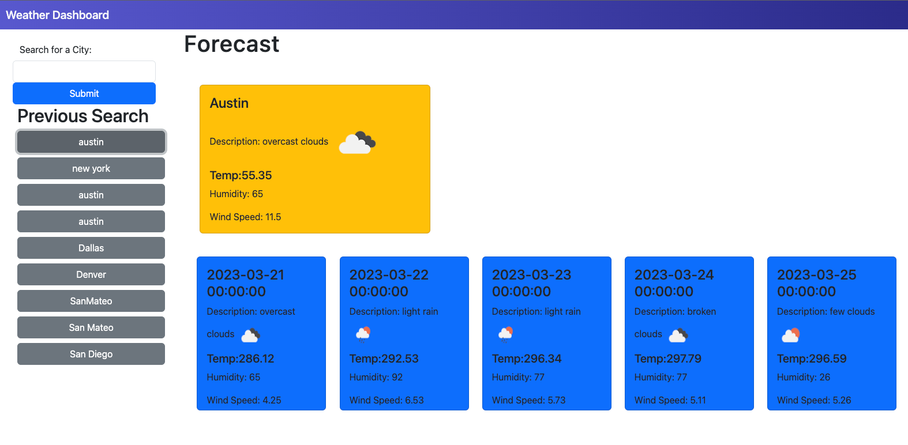
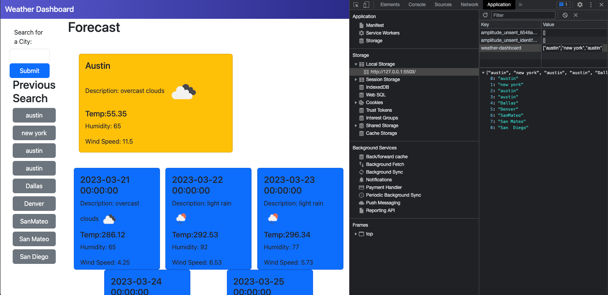
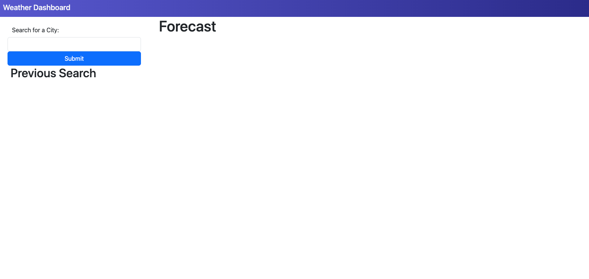
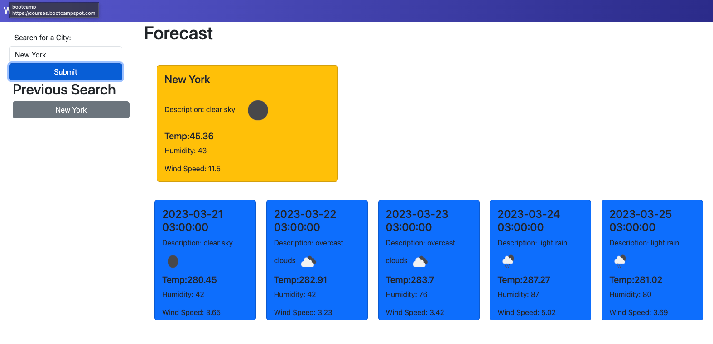

# Weather Dashboard

## Description


This application was built using the openweather API. This project was built to return the current weather as well as a five-day forecast of any given city that the user chooses to input into the search. When the user searches

## Deployed Link

https://cmcnamara15.github.io/Weather_Dashboard/

## User Story

```
AS A traveler
I WANT to see the weather outlook for multiple cities
SO THAT I can plan a trip accordingly
```

## Acceptance Criteria

```
GIVEN a weather dashboard with form inputs
WHEN I search for a city
THEN I am presented with current and future conditions for that city and that city is added to the search history
WHEN I view current weather conditions for that city
THEN I am presented with the city name, the date, an icon representation of weather conditions, the temperature, the humidity, and the wind speed
WHEN I view future weather conditions for that city
THEN I am presented with a 5-day forecast that displays the date, an icon representation of weather conditions, the temperature, the wind speed, and the humidity
WHEN I click on a city in the search history
THEN I am again presented with current and future conditions for that city
```

## Mock-Up

The following image shows the web application's appearance and functionality:


## Page filled with users searches



## Full page filled with local storage opened



## Fresh page with no search history



## New page with one search


